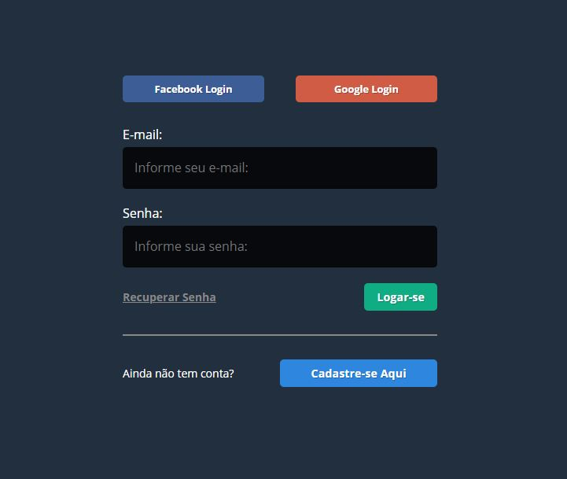

<h1 align="center">
   Sistema De Login
</h1>

<p align="center">
  

  
  
  <a href="https://github.com/LeandroSantosGit/SistemaDeLogin/commits/master">
    
  </a>

  <a href="https://github.com/LeandroSantosGit/SistemaDeLogin/issues">
    
  </a>
  
</p>

<p align="center">
  <a href="#-Projeto">💻 Projeto</a>&nbsp;&nbsp;&nbsp;|&nbsp;&nbsp;&nbsp;
  <a href="#rocket-tecnologias"> :rocket: Tecnologias</a>&nbsp;&nbsp;&nbsp;|&nbsp;&nbsp;&nbsp;
  <a href="#gear-instalação"> :gear: Instalação</a>&nbsp;&nbsp;&nbsp;
  <a href="#-como-contribuir">🤔 Como Contribuir</a>&nbsp;&nbsp;&nbsp;|&nbsp;&nbsp;&nbsp;
  <a href="#memo-licença"> :memo: Licença</a>&nbsp;&nbsp;&nbsp;|&nbsp;&nbsp;&nbsp;
  <a href="#-mailbox_with_mail"> :mailbox_with_mail: Entrar em Contato</a>
</p>

<h1 align="center">
    
</h1>

## 💻 Projeto

Sistema de login em MVC com PHP + Login social via Google e Facebook. Projeto visa programar do jeito certo, com tecnologia moderna, padrões de projeto, seguir recomendações da comunidade e abandonar más práticas e vícios de linguagem. [Material de apoio](https://pages.upinside.com.br/codigoaberto/t1/) do projeto.

Desenvolvido na Temporada 1 Código Aberto da [Upinside](https://www.upinside.com.br/). Um projeto 100% GRATUITO criado por Robson V. Leite da UpInside para oxigenar PHP do jeito certo no Brasil. 🐘


## :rocket: Tecnologias

Esse projeto foi desenvolvido com as seguintes tecnologias:

- [PHP 7.4](https://php.net/)
- [MySQL](https://www.mysql.com/)
- [phpmailer](https://packagist.org/packages/phpmailer/phpmailer)
- [Google OAuth 2.0](https://packagist.org/packages/league/oauth2-google)
- [Facebook OAuth 2.0](https://packagist.org/packages/league/oauth2-facebook)
- [coffeecode](https://packagist.org/packages/league/oauth2-google?query=coffeecode&tags=coffeecode~upinside)

## :gear: Instalação

* Clone o repo: ```git clone https://github.com/LeandroSantosGit/SistemaDeLogin.git```
* Vá para a pasta SistemaDeLogin: ```cd SistemaDeLogin/```
* Instale as dependências com o [composer](https://getcomposer.org/): ```php composer install```
* Importe banco de dados que esta na pasta: ```cd database/```
* Vá para a pasta source ```cd source/``` e no arquivo ```Config.php``` configure: 
    * SITE CONFIG;
    * DATABASE CONNECT;
    * SOCIAL CONFIG;
    * MAIL CONNECT;
    * SOCIAL LOGIN: FACEBOOK;
    * SOCIAL LOGIN: GOOGLE.
* Execute o servidor php integrado: ```php -S localhost:8000``` 
* Agora você pode acessar [http://localhost:8080](http://localhost:8080) para visualizar o projeto.

## 🤔 Como contribuir

- Faça um fork desse repositório;
- Cria uma branch com a sua feature: `git checkout -b minha-feature`;
- Faça commit das suas alterações: `git commit -m 'feat: Minha nova feature'`;
- Faça push para a sua branch: `git push origin minha-feature`.

Depois que o merge da sua pull request for feito, você pode deletar a sua branch.

## :memo: Licença

Esse projeto está sob a licença MIT. Veja o arquivo [LICENSE](LICENSE.md) para mais detalhes.

## :mailbox_with_mail: Entrar em contato

<a href="https://www.linkedin.com/in/leandro-s-7811b1151/" target="_blank" ></a>&nbsp;&nbsp;&nbsp;
<a href="https://twitter.com/rockgolmetal" target="_blank" ></a>&nbsp;&nbsp;&nbsp;
<a href="https://www.facebook.com/leandro.santos.71216" target="_blank" ></a>&nbsp;&nbsp;&nbsp;
<a href="mailto:santosdeveloper19@gmail.com" target="_blank" >
  
</a> 